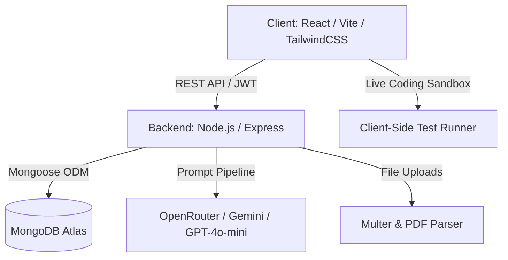

<div align="center">

# ⚡ OfferForge AI

### Next-Generation AI-Powered Career Readiness & Technical Interview Platform

[](https://vitejs.dev/)
[](https://nodejs.org/)
[](https://openrouter.ai/)
[](LICENSE)

<p align="center">
  <strong>OfferForge AI</strong> bridges the gap between preparation and high-impact engineering placement offers. It combines dynamic multi-turn AI mock interviews, an interactive live code sandbox, real-time system design reviews, an automated ATS resume analyzer, and verifiable skill certifications into a unified full-stack ecosystem.
</p>

</div>

---

## 🚀 Key Modules & Features

### 🎙️ 1. Adaptive AI Mock Interviews
- **Multi-Role & Multi-Level**: Practice for Frontend, Backend, Full Stack, DevOps, Machine Learning, and System Architecture roles across Junior, Mid, and Staff levels.
- **Granular AI Telemetry**: Real-time evaluation assessing **Technical Accuracy**, **Communication Clarity**, and **Answer Confidence**.
- **Context-Aware Follow-Ups**: Dynamically drills deeper into edge cases based on candidate answers.

### 💻 2. Live Interactive Code Sandbox
- In-browser code runner supporting algorithmic problem solving with real-time test case execution.
- Automated AI code analysis reviewing Time/Space complexity ($O(N)$), edge case resilience, and readability.

### 🏗️ 3. Interactive System Design Studio
- Architecture canvas designed for high-scale system design rounds (Load Balancers, Microservices, Caching, Sharding, Message Brokers).
- AI architectural feedback evaluating SPOF (Single Point of Failure), bottlenecks, and scalability trade-offs.

### 📄 4. AI Resume & ATS Diagnostic Scanner
- Instant PDF resume parsing with keyword density mapping against targeted job descriptions.
- Computes comprehensive ATS readiness scores, identifying missing technical skills and providing actionable bullet-point revisions.

### 🏅 5. Verifiable Skill Credentials
- Cryptographically stamped completion certificates with public verification hashes for LinkedIn and portfolio showcasing.

### 📊 6. Executive Readiness Dashboard
- Visual skill radar, performance trajectories over time, and interview historical breakdown powered by Recharts.

---

## 🛠️ Architecture & Tech Stack



| Layer | Technologies |
|---|---|
| **Frontend** | React 18, Vite, Tailwind CSS, Lucide Icons, Recharts, Canvas Confetti |
| **Backend** | Node.js, Express, Mongoose ODM, JWT Authentication, Multer, bcryptjs |
| **Database** | MongoDB Atlas (Cloud Managed NoSQL) |
| **AI Intelligence** | OpenRouter API / Google Gemini / OpenAI GPT-4o-mini |
| **Deployment** | Vercel (Frontend Client) & Render / Vercel (Backend Serverless API) |

---

## 📂 Project Structure

```text
OfferForge-AI/
├── backend/
│   ├── config/          # MongoDB connection & environment configuration
│   ├── controllers/     # Authentication, Interview, Resume, & Sandbox logic
│   ├── middleware/      # JWT auth guard, error handling, file uploaders
│   ├── models/          # Mongoose Schemas (User, Interview, Resume, Certificate)
│   ├── routes/          # Express API route declarations
│   ├── utils/           # AI prompt pipelines & response sanitizers
│   └── server.js        # Express application entry point
├── frontend/
│   ├── src/
│   │   ├── components/  # Reusable UI components (Navbar, Modals, Radar, Cards)
│   │   ├── data/        # Static role catalogs, questions, & templates
│   │   ├── pages/       # Home, Interview, CodeSandbox, SystemDesign, Resume, Dashboard
│   │   ├── services/    # Axios API client & authentication service
│   │   └── App.jsx      # Route management & state boundaries
├── render.yaml          # Infrastructure as Code blueprint for Render
├── DEPLOYMENT.md        # Comprehensive multi-cloud deployment checklist
└── README.md            # Platform overview and documentation
```

---

## ⚡ Quick Start & Local Development

### Prerequisites
- **Node.js**: v18.0+ or v20.0+
- **MongoDB Atlas** connection string
- **OpenRouter** or **Gemini API** key

---

### 1. Backend Setup

```bash
# Navigate to backend directory
cd backend

# Install dependencies
npm install

# Create local environment config
cp .env.example .env
```

Edit `backend/.env`:
```env
PORT=5000
NODE_ENV=development
MONGODB_URI=mongodb+srv://<user>:<password>@cluster.mongodb.net/offerforge?retryWrites=true&w=majority
JWT_SECRET=your_super_secret_jwt_key_here
AI_PROVIDER=openrouter
AI_API_KEY=your_openrouter_or_gemini_api_key
AI_MODEL=openai/gpt-4o-mini
FRONTEND_URL=http://localhost:5173
```

Start backend dev server:
```bash
npm run dev
# Server running on http://localhost:5000
```

---

### 2. Frontend Setup

```bash
# Navigate to frontend directory
cd ../frontend

# Install dependencies
npm install

# Create local environment config
cp .env.example .env
```

Edit `frontend/.env`:
```env
VITE_API_URL=http://localhost:5000/api
```

Start frontend dev server:
```bash
npm run dev
# Client running on http://localhost:5173
```

---

## 🌐 Production Deployment

### Option A: Render (Backend) + Vercel (Frontend)
1. **Backend**:
   - Push repository to GitHub.
   - Connect repository to **Render** as a Web Service (using `backend/` root directory or `render.yaml`).
   - Add environment variables (`MONGODB_URI`, `JWT_SECRET`, `AI_API_KEY`, `FRONTEND_URL`).
2. **Frontend**:
   - Import repository to **Vercel** with Root Directory set to `frontend`.
   - Set `VITE_API_URL` to `https://your-backend-service.onrender.com/api`.

### Option B: Full Vercel Serverless
- Follow the instructions in [DEPLOYMENT.md](./DEPLOYMENT.md) for full serverless deployment.

---

## 🛡️ Security & Best Practices

- **Never commit `.env` files** containing live database credentials or API keys.
- **JWT Protection**: All interview history, sandbox runs, and resume diagnostics are securely protected with Bearer tokens.
- **Input Sanitization**: File uploads are scanned, limited in size, and processed in memory buffers.

---

## 👨‍💻 Author & Maintainer

**Lovjyot Singh**  
GitHub: [@LovjyotSingh](https://github.com/LovjyotSingh)

---

<div align="center">
  <sub>Built with ❤️ for aspiring engineers aiming for top-tier software placement offers.</sub>
</div>
